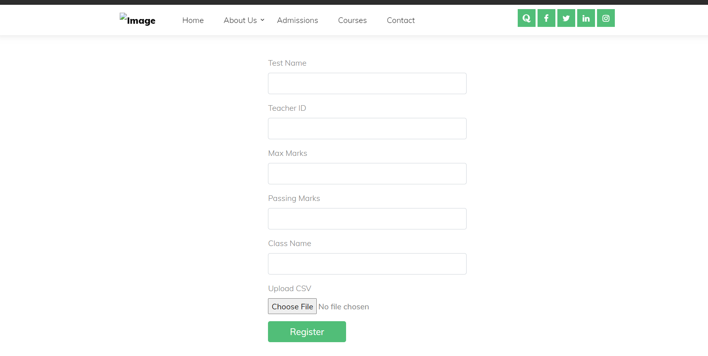

# Merit Analyser
This project was done for Hacksprint2.0 in the year 2020.

Project Team Members:

<li>Nihar Salunke </li>
<li>Nikhil Kulkarni</li>
<li>Shivali Mate</li>

<h1>Output:</h1>
<h2>Class Anaylsis For Teachers</h2>

  
  

  
  

<h2>Home Page</h2>

  
  

<h2>Teacher's Dashboard</h2>

  
  

<h2>Login Page</h2>

  
  

<h2>Student Personal Analysis</h2>

  
  

<h2>Digital Report Card</h2>

  
  

<h2>Student Dashboard</h2>

  
  

